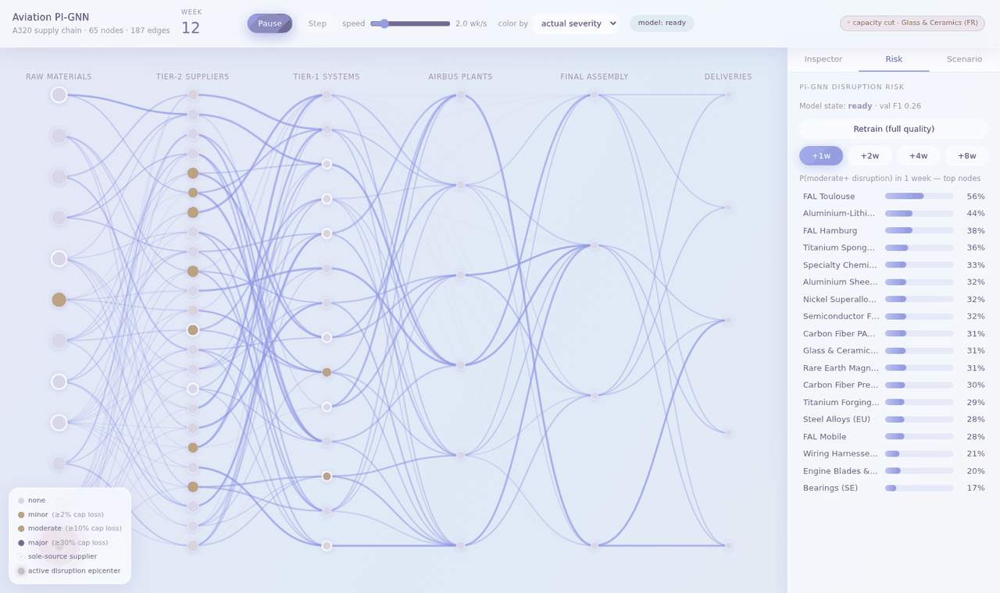

# Aviation Supply Chain Early Warning — Business Overview

*What this project does, why it matters, and where it fits.*

This document is written for non-technical readers. A short technical
appendix at the end covers the underlying research for those who want it.

---

## The problem

Building a commercial aircraft depends on one of the deepest, most global
supply chains in industry. An A320-family jet comes together from raw
titanium and carbon fiber, through thousands of components, into major
systems like engines and landing gear, through Airbus's own component
plants, and finally into four assembly lines on three continents.

Two things make this chain unusually fragile:

1. **Sole-source choke points.** Many critical items — engines, nacelles,
   landing gear, fuselage sections — come from a single supplier. There is
   no quick plan B.
2. **Depth.** A problem three tiers down (a titanium embargo, a chip
   shortage, a fire at a parts plant) takes weeks to surface as a missed
   delivery — and by the time it is visible at final assembly, the cheap
   options are gone.

These are not hypotheticals. Recent aviation history includes engine
inspection campaigns grounding deliveries, titanium sanctions, Red Sea
shipping reroutes adding weeks of transit, and supplier quality escapes
halting fuselage production. Every scenario in this project is modeled on
that class of real event.

**Today, most organizations find out about these problems late.** Planning
tools are good at answering *"what should we do about a problem we already
know about?"* — they are not designed to tell you *which* problem is coming.

## What this system does

Think of it as a **weather forecast for the supply chain**.

The system watches routine weekly operating signals from every node in the
supplier network — inventory levels, capacity utilization, backlogs,
incoming shipments — and for **every supplier, every week**, it forecasts
the probability of a meaningful disruption **1, 2, 4, and 8 weeks ahead**,
graded by severity (none / minor / moderate / major).

The key insight it exploits: disruptions rarely arrive from nowhere. A
supplier heading for trouble usually *looks* like it — inventories thin
out, utilization strains, backlogs creep up — weeks before anything is
officially late. Humans can spot this pattern for a handful of suppliers
they know well. The system spots it across the entire network, every tier,
every week, and it also understands **how trouble travels**: a problem at
a raw-material node raises risk at the component makers it feeds, then at
the system integrators above them.

## Why its predictions can be trusted

A common failure of machine-learning forecasts is that they can be
confidently *nonsensical* — predicting outcomes that are physically
impossible. This system uses a technique called **physics-informed
learning**: during training, the model is penalized whenever its internal
picture of the network breaks basic laws of material flow — creating or
destroying inventory out of nothing, exceeding known plant capacities, or
ignoring shipping lead times.

The effect is measurable. Compared to the identical model trained without
these physics rules, this model's picture of material flow is roughly
**240× more consistent** (flow-conservation error of 0.015 vs 3.59). In
plain terms: the physics-free model routinely "invents" material to make
its story work; this one doesn't. That is what makes its risk scores safe
to feed into downstream planning decisions.

## What exists today

This is a **proof of concept**. No proprietary Airbus data is used —
instead, the system runs on a structurally realistic model of the A320
program network (65 nodes, 187 supply links, with the real program's
sole-source choke points) and three years of simulated weekly operations
with 60 disruption events injected.

Headline results on held-out test data (disruptions are rare — about 4% of
supplier-weeks):

| Question | Answer |
|---|---|
| One week ahead, how many actual disruption-weeks does it catch? | About **3 in 4** (recall 74%) |
| When it raises an alarm, how often is it right? | About **3 in 4** (precision 76%) |
| How good is its risk *ranking* of suppliers? | Excellent at 1–2 weeks (AUC 0.95 / 0.92), strong at 4 weeks (0.84) |
| What about 8 weeks ahead? | Weak — by design of the test: shocks that far out have not yet produced any warning signs to read |

The project also ships a **live web application** (see the
[User Guide](USER_GUIDE.md)): an interactive map of the supply network
where you can run simulated years in minutes, inject disruptions —
a supplier fire, an export embargo, a demand surge — and watch both the
actual damage and the model's early warnings unfold side by side. It is
the fastest way to build intuition for what the system can and cannot see,
and an effective stakeholder demo.

## What you can do with it

1. **Early-warning monitoring.** A weekly-refreshed board of the suppliers
   most likely to be disrupted in the coming weeks, so procurement and
   program teams engage while options are still cheap.
2. **Choke-point stress testing.** The network analysis identifies which
   nodes structurally matter most (sole-source, high-traffic), and the
   simulator shows what happens when they fail.
3. **Mitigation what-ifs.** Interventions can be scored through the model
   before committing money. The counterfactual studies behave the way a
   supply chain professional would expect: adding safety stock at a
   capacity-constrained chip supplier cut its predicted disruption risk
   from 99% to 23% — while the same buffer at an *embargoed* titanium
   supplier barely moved its risk at all (you cannot inventory your way
   out of an export ban; you can only soften the downstream spillover).
4. **Smarter scenario planning.** For organizations already using
   simulation/optimization tools (e.g. AnyLogic), the system exports
   ranked risk scores (`outputs/risk_scores.csv`) that replace hand-picked
   what-if scenarios with model-ranked ones.

## What it is *not*

This system is a **predictive early-warning layer**, not a replacement for
existing planning tools. The division of labor:

| | Simulation & optimization (existing tools) | This system |
|---|---|---|
| Question answered | *"What happens if we run policy X?"* | *"Which suppliers are heading for trouble in the next 1–8 weeks?"* |
| Role | Prescriptive — design and optimize responses | Predictive — monitor and alert |
| Inputs | Modeled process logic | Weekly operating telemetry |

The intended workflow: this system tells you **where to look**; your
simulation stack evaluates **what to do about it**.

## Honest limitations (proof-of-concept stage)

- All results are on **synthetic data**. The network structure is realistic
  but disruption magnitudes and durations are plausible rather than
  calibrated to actual Airbus history.
- Material flow is pooled into a single commodity — a production system
  would track part families per program.
- Long-horizon (8-week) prediction of *brand-new* shocks is inherently
  weak for any system: you cannot read warning signs that don't exist yet.
  The value at long horizons is tracking how *known* trouble will evolve.

## Path to production

The engineering hand-off is deliberately simple: everything downstream of
the data layer is agnostic to where the weekly snapshots come from.
Production-izing means:

1. Replace the simulator's output with real weekly ERP/SCM snapshots in
   the same layout (the `SimResult` structure in `src/pignn/simulate.py`
   is the integration contract).
2. Recalibrate severity thresholds to business definitions of
   minor/moderate/major.
3. Back-test against historical disruptions before trusting live alerts.

---

## Appendix: technical summary

- **Research basis:** *Physics-Informed Graph Neural Networks for Supply
  Chain Disruption Prediction and Mitigation* (Petrova & Hughes, Frontiers
  in Applied Physics and Mathematics, 2025). This project implements the
  paper's method end-to-end on an Airbus-like network.
- **Architecture in one line:** a graph neural network reads each week's
  network state, an LSTM accumulates six weeks of memory per supplier, and
  parallel heads predict severity classes at four horizons plus the
  physical state (production, inventory, flows) that the physics losses
  constrain.
- **Physics constraints:** conservation of flow, capacity limits, and
  lead-time consistency, phased in through a training curriculum.
- **Evaluation:** temporal train/validation/test split (60/20/20); the
  physics-free baseline is the identical architecture with physics weights
  set to zero, isolating the physics contribution. Full metrics:
  `outputs/metrics.json`.

**Glossary.** *Tier:* distance from the final product (tier-1 supplies
Airbus directly). *Sole source:* only qualified supplier of an item.
*FAL:* final assembly line. *Horizon:* how far ahead a forecast looks.
*Precision/recall:* of alarms raised, how many were real / of real events,
how many were caught. *AUC:* quality of the risk ranking (1.0 = perfect,
0.5 = random).
