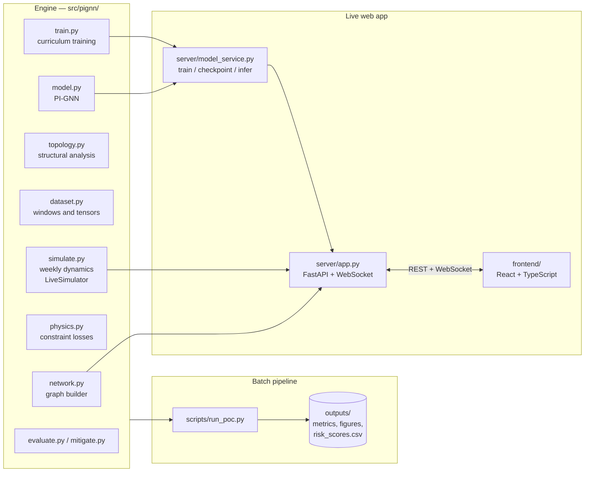
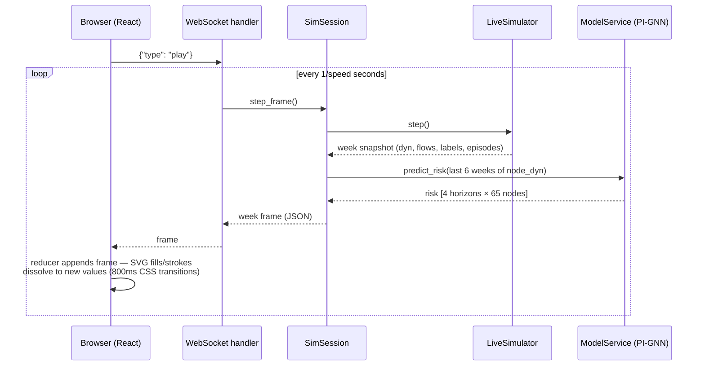

# Technical Guide — What Happens Behind the Scenes

A walkthrough of the system's internals, ordered the way data flows through
it: network → simulator → tensors → model → physics → training → evaluation
→ live backend → frontend. Each section names its source file, so this doc
doubles as a code map. Companion docs: the
[Business Overview](BUSINESS_OVERVIEW.md) (why this exists) and the
[User Guide](USER_GUIDE.md) (how to drive the app).

---

## 1. System architecture

Two entry points share one engine. The **batch pipeline**
(`scripts/run_poc.py`) reproduces the research paper's full experiment set
and writes `outputs/`. The **live backend** (`server/`) wraps the same
engine behind REST + WebSocket for the React frontend.



## 2. The synthetic network — `src/pignn/network.py`

`build_airbus_network(seed)` generates a directed graph of **65 nodes /
187 edges** mirroring the A320 program's structure:

- **Six tiers**: 12 raw-material producers → 24 tier-2 component suppliers
  → 14 tier-1 system integrators → 6 Airbus component plants → 4 final
  assembly lines → 5 delivery/customer sinks. Names are fictionalized
  role-alikes; Airbus site names are real program locations.
- **Node attributes** drawn per tier from seeded uniform ranges:
  `prod_capacity` (units/week), `storage_capacity`, `reliability`
  (∈ [0.85, 0.995]), plus an `is_sole_source` flag on the classic aviation
  choke points (titanium sponge, carbon fiber precursor, engine blades,
  nacelles, landing gear, fuselage sections, …).
- **Edges** are wired randomly tier-to-tier (each destination picks 2–8
  upstream sources) with `lead_time` (weeks), `transport_capacity`
  (a fraction of the source's production capacity), and `cost`.
- **Buyer-furnished equipment**: engine suppliers and the landing-gear
  integrator additionally ship *directly to every FAL*, reproducing the
  real program's pattern and guaranteeing the choke points matter.
- Two repair passes make the graph usable: a **connectivity pass** (every
  non-customer node gets ≥1 outgoing edge, every non-raw node ≥1 incoming)
  and a **feasibility pass** (inbound transport capacity is scaled so every
  producing node can receive ≥1.3× its production rate — otherwise nodes
  would be starved *by construction* rather than by disruption).

`node_static_features()` encodes tier one-hot, normalized capacities,
reliability, sole-source flag, and degrees into a per-node feature block.

## 3. The simulator — `src/pignn/simulate.py`

The heart of the system. Every simulated week executes one pass of
`LiveSimulator.step()`, in this exact order:

1. **Disruption state.** Each scheduled `Episode` contributes an intensity
   at week *t* (see below), producing three modifiers: a per-node capacity
   multiplier (outages/cuts/embargoes; `capacity_cut` applies 60% of its
   magnitude), per-edge extra lead time (`leadtime_spike`, up to +4 weeks),
   and a demand multiplier (`demand_surge` at FALs).
2. **Reliability noise.** Every node's capacity is additionally multiplied
   by `U(reliability, 1.0)` — routine operational jitter.
3. **Arrivals.** The pipeline matrix `pipeline[k, e]` ("arrives in *k*
   weeks on edge *e*") shifts left by one week; slot 0 becomes this week's
   arrivals. Arrivals are accepted **up to storage headroom**; overflow is
   disposed and booked as consumption (this is one of several places the
   accounting is deliberately airtight).
4. **Production.** Non-raw nodes produce `min(effective_capacity ×
   demand_mult, inventory)` — one unit of output consumes one unit of
   pooled input material. Raw nodes curtail to what they can ship or store.
5. **Customer consumption.** Delivery nodes consume exactly what arrives,
   keeping their inventory at zero.
6. **Shipping.** Each node's output is allocated across its outgoing edges
   by a **pull signal** — weights proportional to `transport_capacity ×
   downstream inventory deficit` — capped per-edge by transport capacity.
   Starved downstream nodes therefore attract more material. Unshippable
   output accumulates as producer inventory; anything beyond storage is
   disposed (booked as consumption).
7. **Orders & pipeline.** Realized flows are inserted into the pipeline at
   slot `lead_time + lead_extra` (clamped to the max nominal lead).
8. **Bookkeeping.** Realized capacity reduction = `1 − production/capacity`
   minus each node's reliability noise floor (so quiet weeks label as
   "none"); severity labels are thresholded at 2% / 10% / 30%; the six
   dynamic features per node are recorded: inventory fraction, utilization,
   days-of-supply, decayed backlog, arrivals, capacity reduction.

**Conservation of flow holds by construction** (~1e-8 residual): every unit
produced either ships, stays as inventory, or is booked as disposal-
consumption; every arrival is accepted or disposed. This gives the physics
losses (§7) a ground truth that actually satisfies the constraint they
penalize.

**Episode intensity** is piecewise — the paper's premise that disruptions
announce themselves:

```
intensity(t) = 0.35 · (t − (start − pre)) / pre     start − pre ≤ t < start   (precursor ramp)
             = 1.0                                   start ≤ t < start + dur   (main phase)
             = exp(−(t − end) / recovery)            end ≤ t < end + 3·recovery (tail)
             = 0                                     otherwise
```

The 5-week precursor ramp is what makes prediction possible at all: the
model learns to read slowly degrading output *before* the main phase.

**Batch vs live.** `simulate()` pre-draws stratified episodes
(`_draw_episodes`, biased toward sole-source and high-out-degree nodes) and
steps a fixed horizon; `LiveSimulator` exposes `step()` and
`inject(kind, node, magnitude, duration, start_offset)` for runtime use.
Both run the identical step code — when the live class was extracted, the
batch output was verified **bit-identical** via SHA-256 fingerprint of all
result arrays.

## 4. Topology analysis — `src/pignn/topology.py`

The "dual-framework" analysis from the paper's §3.1:

- **Analytical branch**: degree assortativity, Freeman degree
  centralization, and a Molloy–Reed percolation threshold estimate
  `f_c = 1 − 1/(⟨k²⟩/⟨k⟩ − 1)` — for this network ≈ 0.83, i.e. it stays
  connected under heavy random node loss.
- **Simulation branch**: largest-connected-component profiles under random
  vs betweenness-targeted node removal (`robustness.png` in outputs) — the
  classic result that the network shrugs off random failures but collapses
  under targeted removal of its hubs.
- **Vulnerability ranking**: a composite of betweenness, sole-source flag,
  and (low) clustering, reported in `metrics.json` and shown in the app's
  Inspector empty state.
- **Structural priors**: per-node betweenness, PageRank, clustering, and
  k-core number are appended to the static features — the model starts out
  knowing which nodes are structurally dangerous.

## 5. From simulation to tensors — `src/pignn/dataset.py`

- **Windows.** Each training sample is a sliding window of `T_IN = 6`
  weekly snapshots ending at week `t`. Targets: the severity class of every
  node at `t+1, t+2, t+4, t+8`, plus the *true physical state* at `t+1`
  (production, inventory, consumption per node; flow, arrival per edge)
  used both as auxiliary regression targets and by the physics losses.
- **Normalization.** Every physical quantity is divided by its governing
  capacity — production by `prod_capacity`, inventory by
  `storage_capacity`, flows by `transport_capacity` — so **1.0 means "at
  capacity" everywhere**. This is what makes physics residuals from a
  small fastener supplier and a giant FAL commensurable in one loss term.
- **Graph tensors** (`build_graph_tensors`): edge index, static features,
  row-normalized in/out adjacency matrices for message passing, and the
  capacity vectors the physics losses de-normalize with. `lagged_order`
  (the order placed `lead_time` weeks before the predicted week) is
  precomputed per window for the lead-time loss.
- **Split.** Strictly temporal 60/20/20 over window end-weeks — the test
  period is the *future* relative to training, never shuffled.

## 6. The model — `src/pignn/model.py`

For a batch of windows `dyn: [B, T=6, N=65, F_dyn=6]`:

1. Static features (16 dims: tier one-hot, capacities, reliability,
   sole-source flag, degrees, plus the 4 structural priors) are broadcast
   over time and concatenated with the dynamics → `[B, T, N, 22]`.
2. **2 × directed `GraphConv`**: each layer computes
   `W_self·h + W_in·(A_in h) + W_out·(A_out h)` — suppliers and customers
   are aggregated through *separate* learned projections, because "my
   supplier is struggling" and "my customer is surging" mean different
   things — then ReLU + LayerNorm → `[B, T, N, 64]`.
3. **Temporal memory**: each node's 6-step sequence, concatenated with the
   graph-mean context at each step (`[.., 128]`), runs through a shared
   LSTM (hidden 96); the final hidden state summarizes the node's recent
   trajectory *in context* → `[B, N, 96]`.
4. **Three heads** off that state:
   - `cls_head` → severity logits `[B, 4 horizons, N, 4 classes]`,
   - `node_phys_head` (Softplus) → predicted production / inventory /
     consumption at `t+1` `[B, N, 3]`,
   - `edge_phys_head` (Softplus, fed both endpoint states + edge statics)
     → predicted flow / arrival per edge `[B, E, 2]`.

The physical-state heads exist *so that the physics losses have something
to constrain* — they force the network to maintain an internal, physically
meaningful picture of next week's network state, not just class scores.

## 7. Physics constraints — `src/pignn/physics.py`

Three differentiable penalties on the predicted physical state:

- **Conservation of flow** (`L_flow`): for every node,
  `inflow + production − outflow − consumption − ΔInventory = 0`.
  Predicted edge quantities are de-normalized to material units, node
  terms scaled by production capacity, ΔInventory by storage; the residual
  is normalized by the node's total throughput capacity and squared.
- **Capacity limits** (`L_capacity`): squared hinge `max(0, x − 1)²` on
  normalized production, inventory, and flow — a soft "≤ 100% of capacity".
- **Lead-time consistency** (`L_lead`): predicted arrivals on each edge
  must match the order actually placed `lead_time` weeks earlier (known
  from history) — squared error against `lagged_order`.

The weights ramp in through a curriculum after a prediction-only warm-up:

```
λ(e) = λ_final · (1 − exp(−(e − warmup)/τ))        e ≥ warmup, else 0
```

with per-term finals `LAMBDA_FLOW = 0.02`, `LAMBDA_CAPACITY = 0.2`,
`LAMBDA_LEAD = 0.02` (`config.py`). Ramping matters: hitting an untrained
network with physics penalties from epoch 0 teaches it the degenerate
"predict zero everywhere" solution.

## 8. Training — `src/pignn/train.py`

- **Prediction loss** (both models): class-weighted cross-entropy over all
  horizons/nodes (weights from inverse class frequency, clipped to
  [0.2, 3] — disruption weeks are ~6% of labels) **plus** 0.5 × the
  auxiliary MSE on the physical-state heads. The auxiliary term is included
  for the baseline too, so the *only* experimental difference between
  PI-GNN and baseline is the physics residuals — a clean ablation.
- **Schedule**: 30 warm-up epochs (prediction only) → physics curriculum
  ramps in → up to 150 epochs, Adam (lr 2e-3), gradient clipping at 5.
- **Model selection**: after the curriculum has matured, the checkpoint
  with the best *validation binary F1* (moderate+ detection — the metric
  that matters) is kept; early stopping after 25 stale epochs.
- The baseline GNN is literally `train_model(..., physics=False)`.

## 9. Evaluation & mitigation — `src/pignn/evaluate.py`, `mitigate.py`

**Evaluation** frames "disruption" as severity ≥ moderate (classes {2,3});
the continuous risk score is `P(moderate) + P(major)`. Reported per
horizon: precision/recall/F1 of the hard prediction, ROC-AUC of the risk
ranking, and weighted/macro multiclass F1. Physics-violation diagnostics
(`violation_metrics`) run the same residuals as §7 on the *predicted* state
— that is where the headline "0.015 vs 3.59 flow residual" comparison
comes from.

**Mitigation** (`mitigation_study`) is counterfactual *input* editing: take
the highest-risk (window, node) pairs on the test set, modify the input
window's features — `safety_stock` raises the node's inventory and
days-of-supply channels; `expedite` zeroes its backlog and boosts arrivals
— then re-score the whole network through the frozen model. The deltas at
the node and its 2-hop downstream cone quantify the intervention. It is a
decision-support signal, deliberately not an operational plan.

## 10. The live backend — `server/app.py`, `server/model_service.py`

**Startup** (FastAPI lifespan): build the network (seed from `config.py`),
compute static + structural features, run the topology analysis once, then
construct a `ModelService`. If `outputs/pignn_live.pt` exists it is loaded;
otherwise a **fast-config training run starts in a daemon thread**
(25 epochs vs 150) so the UI gets risk scores ~a minute after first launch.

**`ModelService`** owns the trained model behind a lock. Training runs in a
worker thread (`simulate → temporal_splits → train_model`), saves the
checkpoint, then **hot-swaps** the model — inference never blocks on
training, and `POST /api/model/train {"quality": "full"}` upgrades it
in-place. `predict_risk(window)` takes the last 6 weeks of node dynamics
`[6, N, 6]`, runs one forward pass, and returns risk `[H, N]` (softmax
classes 2+3 summed) plus argmax severity.

**REST**: `GET /api/network` (graph + vulnerability ranking + meta),
`GET /api/metrics` (committed batch results), `GET /api/model`,
`POST /api/model/train`. The built frontend (`frontend/dist/`) is served
statically at `/`.

**WebSocket `/ws/simulation`** — one independent `SimSession` (own
`LiveSimulator`, own RNG/seed, own episode list) per connection:

| client → server | effect |
|---|---|
| `{"type": "play"}` / `{"type": "pause"}` | start/stop the player task |
| `{"type": "step"}` | advance exactly one week |
| `{"type": "set_speed", "wps": 4}` | weeks/second, clamped to [0.25, 20] |
| `{"type": "reset", "seed", "auto_episodes", "n_episodes"}` | new world at week 0 |
| `{"type": "inject", "kind", "node", "magnitude", "duration", "start_offset"}` | schedule an episode |

| server → client | payload |
|---|---|
| `hello` | seed, week, speed, episode schedule, model status (on connect/reset) |
| `week` | one simulated week — see below |
| `status` | playing/speed/week/seed acknowledgements |
| `injected` | the scheduled episode with its id |
| `error` | validation problems |

A **`week` frame** contains the per-node dynamic channels (inventory
fraction, utilization, days-of-supply, backlog, arrivals, capacity
reduction, severity class), per-edge `flow_frac` (flow ÷ transport
capacity — what the frontend maps to thread brightness), active episodes
with live intensities, and — once the session has ≥ 6 weeks of history and
a model is ready — the `risk` block `[horizons][nodes]`. Floats are rounded
to 4 decimals; a frame is ~1,200 numbers, trivially cheap at 20 fps.

The **player** is an asyncio task per connection: `step_frame()` runs in a
thread (`asyncio.to_thread`) so the numpy/torch work never blocks the event
loop; a send lock keeps player frames and control acknowledgements from
interleaving mid-message.

## 11. A live week, end to end



## 12. The frontend — `frontend/src/`

- **`useSimulation.ts`** — the entire client protocol in one hook: opens
  the WebSocket (auto-reconnect with exponential backoff), reduces typed
  `ServerMsg` unions into `SimState` (rolling buffer of the last 600 week
  frames for sparklines, latest frame, episode schedule, model status), and
  exposes imperative controls (`play/pause/step/setSpeed/reset/inject`).
- **`types.ts`** mirrors the server payloads 1:1 — the shared contract.
- **`NetworkView.tsx`** — pure SVG, no chart library. Layout is computed
  once per network: tier index → column x, rank within tier → y. Edges are
  cubic Béziers with control points at the horizontal midpoint. Everything
  live (node fill, edge stroke/width/opacity) is written as plain
  attributes and *animated by CSS transitions* (~800ms) — React re-renders
  set the target, the browser does the dissolve. Disruption halos are
  blurred circles with a CSS breathing keyframe; all motion sits behind
  `prefers-reduced-motion`.
- **`color.ts`** — the single source of severity colors and the sequential
  risk ramp (validated against the light surface; the UI never encodes
  severity by color alone).
- **Panels** — `NodePanel` (telemetry sparklines fed by the frame buffer),
  `RiskPanel` (per-horizon ranking + train controls), `ScenarioPanel`
  (injection form + reset), `Sparkline` (single-series SVG line + gradient
  wash + crosshair).
- Dev mode: Vite proxies `/api` and `/ws` to `:8000` (`vite.config.ts`);
  production: FastAPI serves `frontend/dist/`.

## 13. Configuration reference — `config.py`

| Knob | Default | Effect |
|---|---|---|
| `SEED` | 42 | Network structure, simulation, and training reproducibility |
| `N_WEEKS` / `N_DISRUPTION_EPISODES` | 156 / 60 | Simulated history length and event density |
| `BASE_STOCK_WEEKS` | 3.0 | Initial inventory cover (weeks of demand) |
| `SEVERITY_MINOR/MODERATE/MAJOR` | 0.02 / 0.10 / 0.30 | Label thresholds on realized capacity reduction |
| `T_IN` | 6 | Input window length (weeks of history per prediction) |
| `HORIZONS` | (1, 2, 4, 8) | Forecast horizons |
| `TRAIN_FRAC` / `VAL_FRAC` | 0.6 / 0.2 | Temporal split (rest is test) |
| `NODE_EMBED_DIM` / `GNN_LAYERS` / `LSTM_HIDDEN` | 64 / 2 / 96 | Model capacity |
| `EPOCHS` / `WARMUP_EPOCHS` | 150 / 30 | Training length, prediction-only phase |
| `LAMBDA_FLOW/CAPACITY/LEAD` | 0.02 / 0.2 / 0.02 | Final physics weights |
| `CURRICULUM_TAU` | 20.0 | How fast physics ramps in after warm-up |

The server's "fast" quality overrides `EPOCHS=25, WARMUP_EPOCHS=8,
CURRICULUM_TAU=5` (`server/model_service.py`); the batch `--fast` flag
applies the same overrides in `scripts/run_poc.py`.
