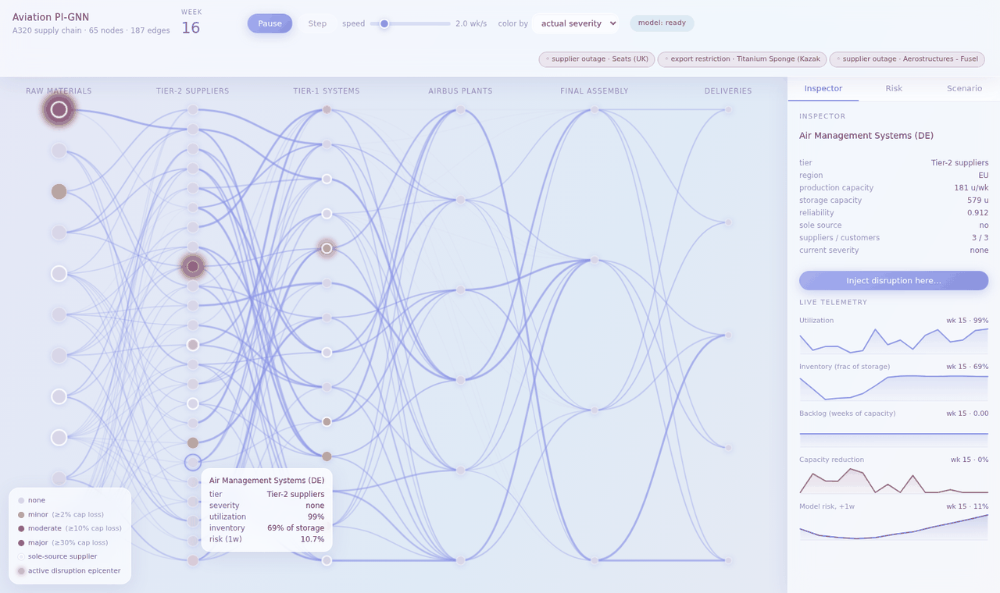
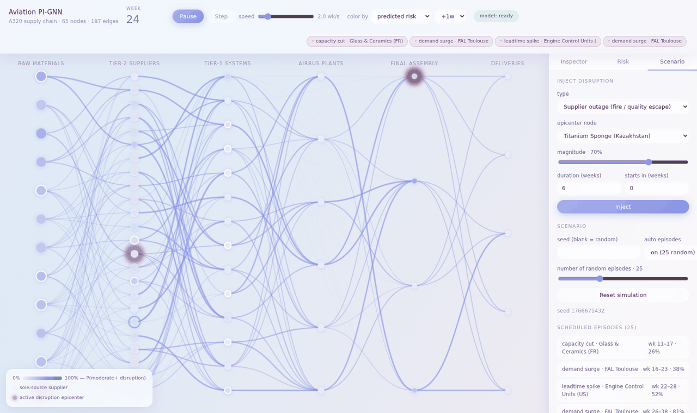

# User Guide — Live Simulation Web App

A task-oriented guide to running and using the interactive supply chain
simulation. For what the project is and why it exists, read the
[Business Overview](BUSINESS_OVERVIEW.md) first; for how it all works under
the hood, see the [Technical Guide](TECHNICAL_GUIDE.md).

---

## 1. Getting started

**Prerequisites:** Python 3.10+, Node.js 18+ (Node is only needed if you
want to rebuild or hot-reload the frontend).

```bash
# one-time setup
pip install -r requirements.txt

# start the app (from the repo root)
uvicorn server.app:app --port 8000
```

Open **http://localhost:8000** — the pre-built frontend is served directly
by the backend.

For frontend development with hot reload instead:

```bash
cd frontend && npm install && npm run dev   # opens on :5173, proxies to :8000
```

**What happens on first launch:** the backend trains a quick disruption
model in the background (about a minute on a laptop CPU). The badge in the
top bar goes `model: training` → `model: ready`. You can play the
simulation immediately — risk scores simply appear once the model is ready
*and* the simulation has run at least 6 weeks (the model needs a 6-week
window of history to make its first prediction). The trained model is
saved to `outputs/pignn_live.pt` and reloaded on later launches, so
training happens once.

> **Tip:** the auto-trained model is a fast, low-quality "smoke" version
> (validation F1 ≈ 0.26). For risk scores that match the numbers in the
> Business Overview, open the **Risk** tab and click **Retrain (full
> quality)** — it takes a few minutes and hot-swaps in when done.

## 2. A tour of the screen


**Top bar, left to right:**

- **Week counter** — how many simulated weeks have elapsed.
- **Play / Pause / Step** — run continuously or advance one week at a time.
- **Speed slider** — 0.5 to 12 simulated weeks per second.
- **Color by** — switch the map between *actual severity* (what is
  happening now) and *predicted risk* (what the model expects), with a
  horizon picker (+1w/+2w/+4w/+8w) in risk mode.
- **Model badge** — `training` / `ready` / `failed`.
- **Event chips** (right) — disruptions currently in progress.

**The map.** Each circle is a supply chain node. Columns are tiers, flowing
left → right: raw materials → tier-2 components → tier-1 systems → Airbus
plants → final assembly → airline deliveries.

- **Circle size** ∝ production capacity.
- **Bright white ring** = sole-source supplier (a choke point).
- **Rose halo (breathing)** = epicenter of an active disruption.
- **Threads between circles** = supply links; they brighten and thicken
  with the material actually flowing this week.
- **Hover** any node for its live stats; **click** to open it in the
  Inspector. The legend (bottom-left) always explains the current coloring.

**Sidebar tabs:** Inspector (one node in depth), Risk (the model's
ranking), Scenario (inject disruptions, reset the world).

## 3. Reading the colors

**Actual severity** (default): how much of each node's production capacity
was actually lost this week — mist gray = none, honey = minor (≥2%), coral
= moderate (≥10%), rose = major (≥30%). Healthy nodes deliberately fade
into the background so trouble stands out.

**Predicted risk**: the model's probability that each node suffers a
moderate-or-worse disruption within the chosen horizon — deeper violet =
higher risk. This is the forward-looking view: a node can look calm in
severity mode and already be deep violet at +2w.

The most instructive way to watch: play in **severity** mode to see what
actually happens, then replay a similar scenario in **risk** mode and watch
the violet deepen *before* the coral/rose appears.

## 4. Inspecting a node



Click any node (or a row in the Risk tab). The Inspector shows its static
profile — tier, region, capacities, reliability, sole-source flag — and
live telemetry sparklines:

| Sparkline | What it means | What to watch for |
|---|---|---|
| **Utilization** | Production vs capacity | Sagging = something upstream is starving it |
| **Inventory** | Stock on hand vs storage | A steady slide toward zero precedes stoppages |
| **Backlog** | Unmet demand accumulating | Climbing backlog = it can't keep up |
| **Capacity reduction** | Realized loss (this drives severity) | Spikes = disruption in progress |
| **Model risk** | Predicted P(moderate+) at your chosen horizon | Rising *while other lines still look fine* is the model earning its keep |

Hover any sparkline for a per-week crosshair readout. The **"Inject
disruption here…"** button jumps to the Scenario tab with this node
pre-selected.

## 5. The Risk board

The **Risk** tab ranks the network by predicted disruption probability at
the horizon you pick (+1w to +8w). Use it as the "where should I look?"
view: click a high-riser to open it in the Inspector and see *why* (thin
inventory? climbing backlog? an active episode upstream?).

Expect the ranking to be sharpest at +1w/+2w and increasingly a "usual
suspects" list (sole-source and structurally central nodes) at +8w — that
mirrors the real predictability limits described in the Business Overview.

## 6. Injecting disruptions



The **Scenario** tab lets you play adversary:

| Type | Real-world analogy | What it does |
|---|---|---|
| Supplier outage | Fire, quality escape | Cuts the node's capacity by the chosen magnitude |
| Capacity cut | Engine inspection campaign | Partial capacity loss (60% of magnitude) |
| Lead-time spike | Suez/Red Sea rerouting | Adds transit weeks on the node's links |
| Export restriction | Titanium sanctions | Capacity cut aimed at raw-material nodes |
| Demand surge | Ramp-up outpacing suppliers | Inflates demand at a final assembly line |

Set **magnitude** (how hard), **duration** (how long), and **starts in**
(lead time before the main phase), then **Inject**. The episode appears in
the schedule list; when it activates you'll see the rose halo, the event
chip, and — some weeks later — coral/rose severity spreading downstream.

> **The one tip that matters:** give injections a few weeks of lead time
> (e.g. *starts in: 4*). Real disruptions announce themselves through a
> precursor ramp — slowly degrading output before the main event — and
> that ramp is exactly what the model learned to detect. An injection with
> *starts in: 0* skips the warning phase entirely; it is an out-of-nowhere
> shock, and the model (like anyone) can only react after onset. With lead
> time, you'll watch the node's predicted risk climb *before* anything
> visibly breaks — which is the whole point of the system.

**Suggested first experiment:**

1. In Scenario, set *auto episodes* **off**, click **Reset simulation** —
   a quiet baseline.
2. Play at ~4 wk/s for 10–15 weeks; enjoy the calm.
3. Inject an **export restriction** on *Titanium Sponge (Kazakhstan)*,
   magnitude ~80%, duration 10, **starts in 5**.
4. Switch *color by* to **predicted risk**, horizon +2w, and watch the
   violet deepen at the titanium node and then bleed into the tier-2
   machining and forging nodes it feeds — before severity mode shows any
   damage.

## 7. Scenarios, seeds, and resets

- **Seed** — a number that makes a run exactly reproducible. Leave blank
  for a fresh random world; note the displayed seed to share a scenario.
- **Auto episodes** — when on, the world comes pre-loaded with the chosen
  number of random disruptions (the schedule list shows what's coming —
  spoilers included). Turn off for a clean sandbox.
- **Reset simulation** — rebuilds the world at week 0 with those settings.
  Your injections are not preserved across resets.

Each browser tab gets its own independent simulation, so you can run a
quiet baseline and a stress scenario side by side.

## 8. Managing the model

| Badge | Meaning | What to do |
|---|---|---|
| `training` | A model is being trained in the background | Keep playing; risk appears when ready |
| `ready` | Risk scores are live | Check *val F1* in the Risk tab — ≈0.26 means the fast smoke model |
| `failed` / `untrained` | Training errored or never ran | Risk tab shows the error and Train buttons |

**Retrain (full quality)** in the Risk tab runs the paper-configuration
training (a few minutes); the new model hot-swaps in without restarting
anything. For automation, the same operations exist as REST endpoints:
`GET /api/model` (status) and `POST /api/model/train` with
`{"quality": "fast"}` or `{"quality": "full"}`.

## 9. Troubleshooting

| Symptom | Cause & fix |
|---|---|
| "Backend unreachable" page | The FastAPI server isn't running — start it with `uvicorn server.app:app --port 8000` from the repo root |
| "connecting to simulation backend…" banner | The WebSocket dropped (e.g. server restart); it reconnects automatically within seconds |
| No risk column / "Risk scores appear once…" | Normal before simulation week 6, or while the model badge is still `training` |
| Risk scores seem poor | You're on the fast smoke model — Retrain (full quality) |
| Model badge `failed` | Open the Risk tab for the error text; click Train to retry |
| Blank page after rebuilding the frontend | Rebuild output goes to `frontend/dist/`, which the backend serves — re-run `npm run build` and refresh |

## 10. Beyond the app

The batch pipeline is unchanged and produces the full evaluation suite
(metrics, figures, and the AnyLogic-ready `risk_scores.csv`):

```bash
python scripts/run_poc.py          # full study, ~8–10 min on CPU
python scripts/run_poc.py --fast   # 15-second smoke test
```

Outputs land in `outputs/` — see the [README](../README.md) for the full
list and the committed results.
